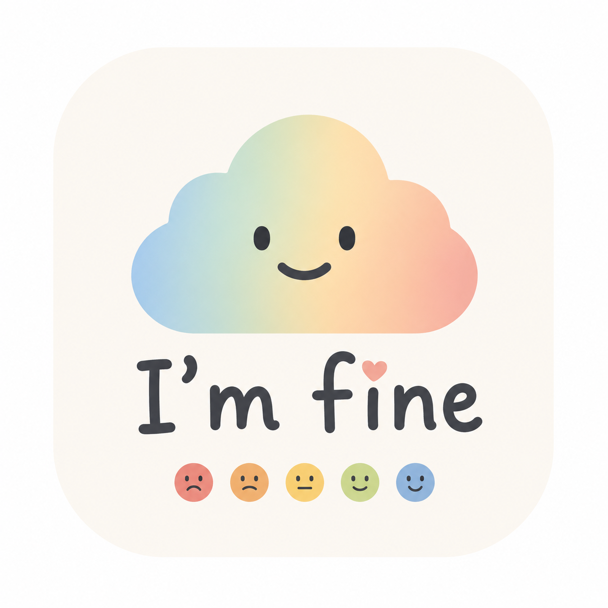

# I'm fine — v1.0

A personal mood tracking app that runs entirely in the browser — no server, no dependencies. Log how you feel each day, review your history, and visualise patterns over time with a colour heatmap.

Hosted on GitHub Pages. Open `index.html` directly or visit the live URL.

---

## Features

### Log tab

- Select a mood from a 5-level scale: Awful, Bad, Okay, Good, Great
- Tag what influenced your mood (Work, Family, Friends, Food, Boyfriend, Sleep, Exercise, Weather, Stress, Social)
- Add an optional free-text note
- The three most recent entries are shown below the form

### History tab

- All entries listed newest first
- Each entry shows the mood, date, time of day (Morning / Afternoon / Evening / Night), tags, and note
- Summary stats at the top: average mood (1–5), total entries, most frequent tag

### Heatmap tab

- **Month view** — calendar grid for any month, each day coloured by mood
- **Year view** — compact 12-month overview for any year
- Navigate backwards and forwards with the arrow buttons
- Hover over any day to see a tooltip with all entries for that day: mood, time of day, tags, and note
- Days with no entry are shown in a neutral grey

### Settings (gear icon)

- **Theme** — Light or Dark mode
- **Moods** — change the icon and colour for each of the 5 mood levels; the heatmap and history update instantly
- **Tags** — add or remove tags that appear in the log form
- **Reset to defaults** — restores the original icons, colours, and tags
- **GitHub Sync** — configure a GitHub username, repository, and personal access token to back up your data

---

## Data & storage

All data is stored in the browser's **`localStorage`** — no server needed.

| Key | Contents |
| --- | --- |
| `imfine_entries` | All mood entries (array) |
| `imfine_settings` | Theme, mood customisations, tags, GitHub config |

### GitHub backup

Press the **cloud icon** next to "How are you feeling?" to push a snapshot of all your data to `data.json` in your GitHub repository. The button shows:

- **Saved** (green) — push succeeded
- **Not saved** (yellow) — push failed or GitHub sync is not configured

To set it up: Settings → GitHub Sync → enter your GitHub username, repository name, and a [personal access token](https://github.com/settings/tokens) with `repo` (or `contents: write`) scope.

The file written to GitHub has this shape:

```json
{
  "entries": [...],
  "tags": ["Work", "Family", ...],
  "theme": "light",
  "moods": [
    { "name": "Awful", "icon": "ti-mood-sad", "bg": "#FCEBEB", "border": "#F09595" }
  ]
}
```

Mood values: `0` Awful · `1` Bad · `2` Okay · `3` Good · `4` Great

---

## File structure

```
v1.0/
├── index.html     # App markup and all JavaScript
├── styles.css     # All styles (light + dark mode)
├── image.png      # App icon
└── README.md
```

---

## Migrating from v0.0

v1.0 removes the Node.js server entirely. Your existing entries from `data.json` are embedded as seed data in `index.html` and will be loaded into `localStorage` automatically on first open. After that, all new entries are written to `localStorage` and `data.json` is no longer used locally.
